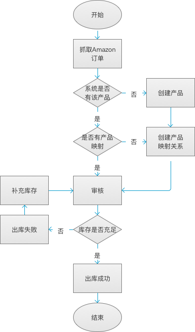

##### 订单(出库)模块

现ERP的订单都是基于亚马逊订单，通过接口抓取……同系统的SKU进行映射后出库。
所以。订单的出库流程图如下：

根据流程图可知，订单出库前需要具备以下条件
1. [ERP具有对应的SKU](../product/product.md)
2. [ERP同Amazon具有对应的SKU映射关系](../product/sku-map.md)
3. [库存充足](../inventory/inventory.md)

订单页面包含以下操作
1. [更新订单商品SKU](sku-map.md)
2. [审核](check.md)