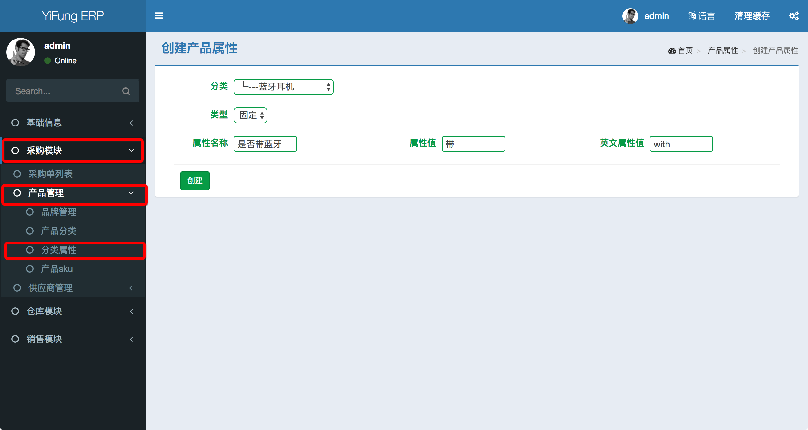
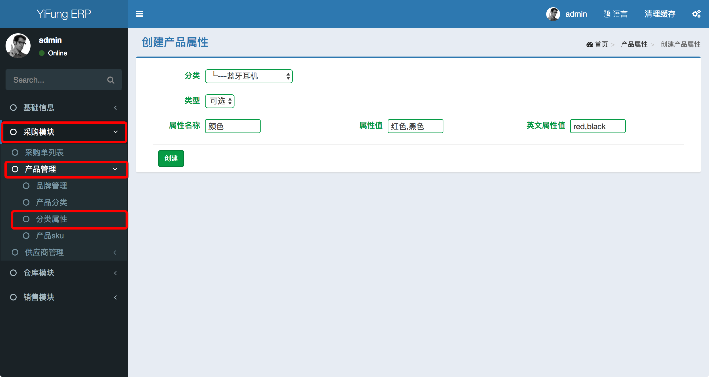

#### 分类属性管理

分类属性是与分类绑定的，即需要先创建分类，才能添加该分类的分类属性。

路径： `采购模块/产品管理/分类属性`

关键字
1. 固定属性: 非影响拆分产品最小单位的凭据, 比如IPHONE 是否带电池
2. 可选属性: 拆分产品最小单位的凭据，比如IPHONE 颜色有白色、黑色、红色, 可选属性至少一个，多个时以`,`分割
    > * 正确: "白色,黑色,红色"
    > * 错误: "白色、黑色 红色"

创建分类固定属性界面如下

创建分类可选属性界面如下
