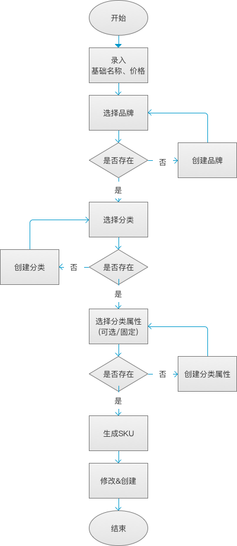

#### 产品模块

**介绍：** 产品模块是供应商模块、采购(入库)模块、出库(订单)模块、库存模块的基础。 在使用本系统前。需要将基础的产品资料录入系统。

创建产品路径： `采购模块/产品管理/产品sku`

录入产品资料需遵循以下流程图：

根据流程图，创建产品时需要提前录入以下对应的数据
1. [品牌](brand.md)
2. [分类](category.md)
3. [分类属性](category-attribute.md)
    > * 可选属性
    > * 固定属性