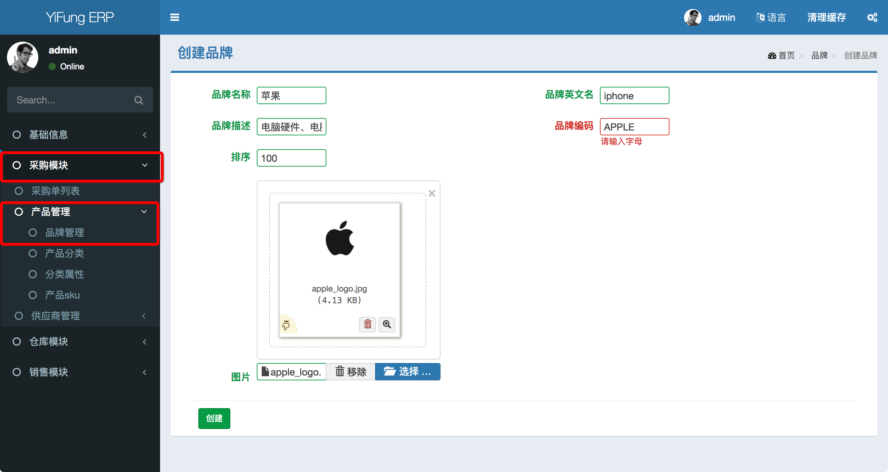

#### 产品管理

创建产品需要提前录入以下相关数据
1. [品牌](brand.md)
2. [分类](category.md)
3. [分类属性](category-attribute.md)
    > * 可选属性
    > * 固定属性

路径： `采购模块/产品管理/产品sku`

关键字
1. 品牌编码: 唯一且只能由大写字母组成的字符
    > * 正确: APPLE、SAMSUNG
    > * 错误：Apple、APPLE-1

创建品牌界面如下
