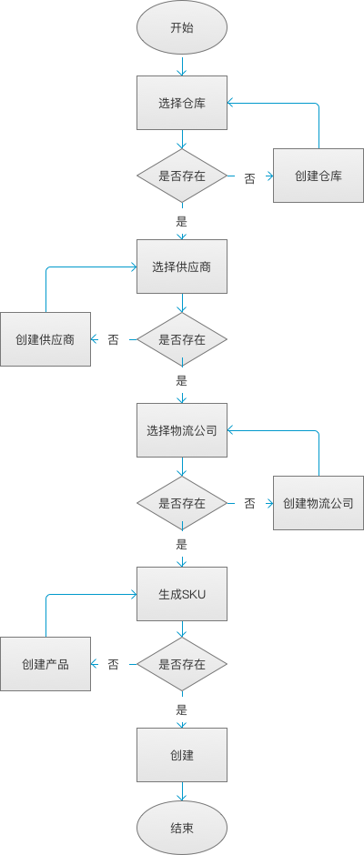
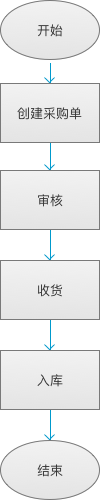

##### 采购(入库)模块

采购(入库)模块主要有以下功能
1. [采购单管理](purchase.md)
    * 采购单管理路径： `采购模块/采购单列表`
    * 创建采购单流程图如下
    
      
2. [入库流程](inventory-in.md)
    * 入库流程图如下
    
      

根据创建采购单的流程图，需要提前录入以下对应的数据
1. [仓库](../inventory/warehosue.md)
2. [供应商](../supplier/supplier.md)
3. [物流公司](logistics.md)
4. [产品](../product/product.md)