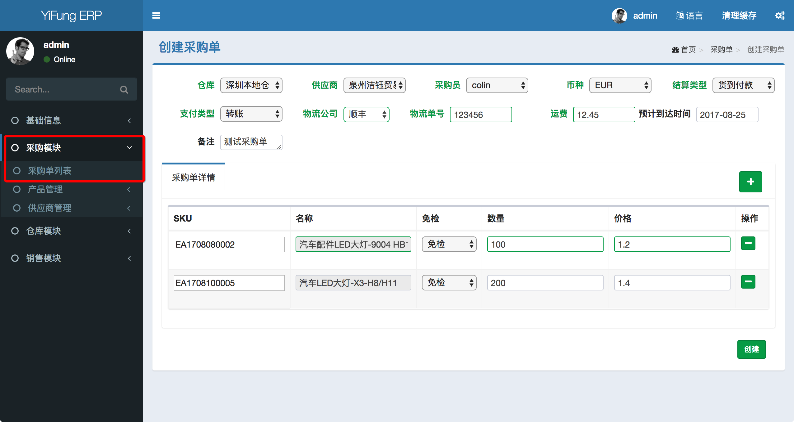

##### 采购单管理

具有管理采购单的功能，即采购单的查看、创建、修改、删除，以及采购单的审核、收货、入库功能。

路径： `采购模块/采购单列表`

创建采购单前需要提前录入以下对应的数据
1. [仓库](../inventory/warehosue.md)
2. [供应商](../supplier/supplier.md)
3. [物流公司](logistics.md)
4. [产品](../product/product.md)

创建采购单界面如下

创建采购单后，还有后续操作，即
1. [审核](check.md)
2. [收货](arrived.md)