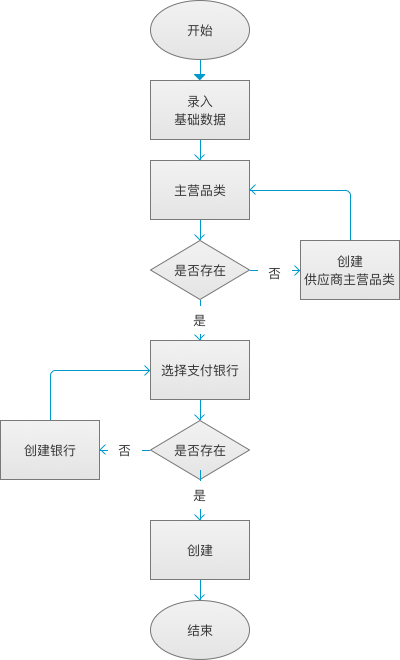
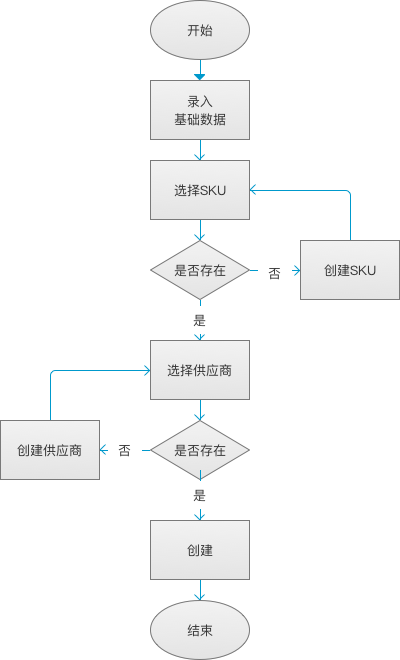

##### 供应商模块

供应商管理主要有以下功能
1. [供应商基础资料](supplier.md)
    * 创建供应商路径： `采购模块/供应商管理/供应商`
    * 创建供应商流程图如下
    
      
2. [供应商产品报价](supplier-product.md)
    * 录入供应商产品报价路径： `采购模块/供应商管理/供应商报价`
    * 录入供应商产品报价流程图如下
    
      

根据流程图，创建供应商及供应商报价时需要提前录入以下对应的数据
1. [产品SKU](../product/product.md)
2. [主营品类](supplier-product.md)
3. [支付银行](bank.md)